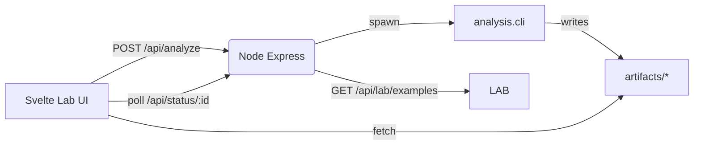

# Architecture — Creamery Lab

Key notes:
- The analysis CLI is the single source of truth for generating artifacts.
- The Lab only reads artifacts and builds non-destructive "scene" overlays.
- All lab endpoints are gated by `LAB_MODE` for safety.
